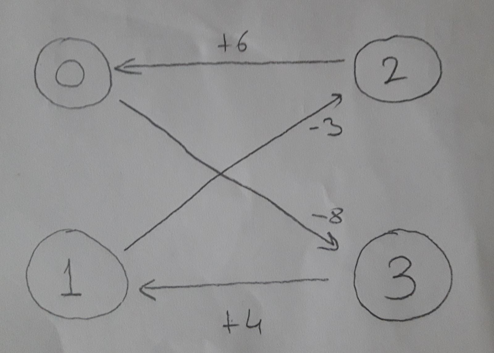

# project4
First thing I did was to take all voltages negative. This way minimum cost would give the maximum voltage. Then for every node on the left I chose an arbitrary edge (opposite nodes) and reversed edge directions and cost signs (like a residual graph). If there is a negative cost cycle in this graph that means there is a cheaper way to take. If that is the case, reverse all edges on that cycle and check if there is a better way again by looking for negative cycles. Repeat this until there is no negative cycles. Positive signed edges are the optimal routes to take. My graphical model for the first test case is below.

